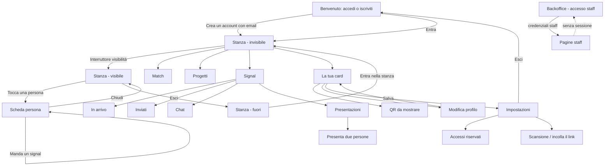

# Lobby — Report del test automatico end-to-end

## 1. Intestazione e sintesi

| | |
|---|---|
| **Progetto** | Lobby — app soci (Expo / React Native Web) + backoffice staff (Next.js) |
| **Data di esecuzione** | 3 ottobre 2026, 15:24 UTC |
| **Versione provata** | branch `feat/lobby-schema-and-room-redesign` unito a `main` (`260d470`) |
| **Strumento** | Playwright 1.63 · Chromium · viewport 1280×800 (screenshot a 2560×1600) |
| **Script** | `scripts/claude_auto_test.js` — si rilancia con `node scripts/claude_auto_test.js` |
| **Account di prova** | `demo_claude_1791041095083@test.com` (password generata a caso, mai stampata) |
| **Ambienti** | App soci `http://localhost:8082` · Backoffice `http://localhost:3005` |
| **Schermate analizzate** | 30 (27 dell'app soci, 3 del backoffice) |
| **Esito complessivo** | ✅ **Funzionante** — 30 ✅ · 0 ⚠️ · 0 ❌ |

**Obiettivo.** Percorrere in autonomia tutta l'app come farebbe un nuovo socio — registrazione, accesso, ogni sezione, ogni controllo principale — fotografando ogni schermata e registrando errori di console, di navigazione e di accessibilità.

**Come ci si è arrivati.** La prima esecuzione, su una copia locale non aggiornata, aveva dato 26 ✅ · 3 ⚠️ · 1 ❌. I difetti sono stati corretti; nel frattempo `main` era avanzato di 26 commit (restyling, PWA, backoffice in italiano, nuove regole di sicurezza). Il branch è stato unito a `main`, le correzioni ancora necessarie riapplicate sul codice nuovo e il test adattato alla nuova interfaccia. Questo report descrive l'esecuzione finale.

**Cosa non è stato provato, e perché.**

- **L'app soci gira in modalità dimostrativa.** Da `main` in poi l'app, senza configurazione, si collega al database vero: la dimostrazione va chiesta con `EXPO_PUBLIC_DEMO=1` in `apps/mobile/.env.local`. Lo script ora **si ferma** se non la trova, per non creare account reali. In dimostrazione registrazione e accesso sono simulati: il test verifica interfaccia e navigazione, **non** l'autenticazione reale né le regole del database.
- **Il backoffice oltre il login non è stato aperto.** Non ha una registrazione e il suo login parla con il progetto Supabase condiviso con prodotti in produzione. Sono stati verificati la pagina di accesso, la validazione del modulo e la protezione delle rotte.
- Fotocamera, accessi con LinkedIn / Google / Apple e notifiche push non sono verificabili in un browser automatizzato.

---

## 2. Mappa del flusso utente

---

## 3. Analisi schermata per schermata

### App soci

#### 01 · Benvenuto

- **Scopo:** porta d'ingresso; un solo gesto per accedere o iscriversi.
- **Componenti:** pulsanti LinkedIn, Google e Apple; campi email e password; "Entra (dimostrativo)"; "Crea un account con email".
- **Esito:** ✅ Funzionante — modalità dimostrativa confermata.

#### 02 · Registrazione — modulo compilato

- **Scopo:** creare un nuovo account con email.
- **Componenti:** email e password compilate con l'account di prova univoco.
- **Esito:** ✅ Funzionante

#### 03 · Dopo la registrazione

- **Scopo:** primo approdo del nuovo socio.
- **Componenti:** intestazione della stanza, barra di presenza, barra delle schede.
- **Esito:** ✅ Funzionante — in dimostrazione si entra subito nella stanza, invisibili.

#### 04 · Card e impostazioni

- **Scopo:** raggiungere le impostazioni per uscire dall'account.
- **Componenti:** card con identità, "Mostra il QR", blocco privacy con "Impostazioni" (sotto la piega: lo script scorre).
- **Esito:** ✅ Funzionante

#### 05 · Accesso con le credenziali create

- **Scopo:** uscire e rientrare con l'account appena creato.
- **Componenti:** "Esci", modulo di accesso, ritorno alla stanza.
- **Esito:** ✅ Funzionante

#### 06 · Stanza — dentro, invisibile

- **Scopo:** sei nel luogo ma nessuno ti vede finché non lo decidi tu.
- **Componenti:** "Sei qui, ma nessuno ti vede", interruttore di visibilità spento (`aria-checked=false`), conto alla rovescia.
- **Esito:** ✅ Funzionante — l'invisibilità all'ingresso è rispettata.

#### 07 · Stanza — visibile

- **Scopo:** vedere chi c'è, una volta resi visibili.
- **Componenti:** interruttore acceso (`aria-checked=true`), "2h 59m", riquadro "Visibile", "Invita scansionando una card", Mia Chen 87%.
- **Esito:** ✅ Funzionante — interruttore ed "Esci" hanno un'area toccabile di 44 px.

#### 08 · Scheda della persona

- **Scopo:** approfondire un profilo prima di contattarlo.
- **Componenti:** foglio dal basso con sigillo, offre / cerca, motivo dell'affinità, frase d'apertura, "Manda un signal".
- **Esito:** ✅ Funzionante — l'esito del signal compare nella scheda ("Modalità dimostrativa: i signal non partono").

#### 09 · Match

- **Scopo:** le persone più compatibili.
- **Componenti:** elenco con punteggio e motivi.
- **Esito:** ✅ Funzionante — la scheda persona si era chiusa correttamente.

#### 10 · Progetti

- **Scopo:** vetrina dei progetti.
- **Componenti:** scheda "Hearth Exchange" con descrizione.
- **Esito:** ✅ Funzionante

#### 11 · La tua card

- **Scopo:** identità e sigillo del socio.
- **Componenti:** nome, email, azienda, sigillo, "Modifica", "Mostra il QR".
- **Esito:** ✅ Funzionante

#### 12 · QR da mostrare

- **Scopo:** farsi riconoscere di persona.
- **Componenti:** codice QR in SVG, "Chiudi".
- **Esito:** ✅ Funzionante

#### 13 · Modifica profilo

- **Scopo:** aggiornare ciò che si mostra.
- **Componenti:** "In evidenza", "Offro", "Cerco", "Salva", "Annulla".
- **Esito:** ✅ Funzionante

#### 14 · Profilo salvato

- **Scopo:** verificare che la modifica resti.
- **Componenti:** la card con il testo appena inserito.
- **Esito:** ✅ Funzionante — la modifica compare sulla card.

#### 15 · Impostazioni

- **Scopo:** accessi, scansione, uscita.
- **Componenti:** freccia indietro, "Accessi riservati", "Scansiona un QR", "Esci".
- **Esito:** ✅ Funzionante — la freccia si annuncia come "Indietro".

#### 16 · Accessi riservati

- **Scopo:** ciò che il venue concede al socio.
- **Componenti:** "Terrazza sul tetto — soci", "2 inviti per ospiti al mese".
- **Esito:** ✅ Funzionante

#### 17 · Scansione QR

- **Scopo:** entrare in una stanza con il codice del luogo.
- **Componenti:** sul web "Entra con il link" con campo per incollare, "Usa la fotocamera", "Chiudi".
- **Esito:** ✅ Funzionante — verificata solo la variante web; la lettura con fotocamera va provata su un telefono.

#### 18 · Signal — in arrivo

- **Scopo:** le richieste di contatto ricevute.
- **Componenti:** selettore a quattro sezioni, stato vuoto.
- **Esito:** ✅ Funzionante

#### 19 · Signal — inviati

- **Scopo:** le richieste mandate e in attesa.
- **Componenti:** stato vuoto "Nessun signal in attesa".
- **Esito:** ✅ Funzionante

#### 20 · Signal — chat

- **Scopo:** le conversazioni aperte dopo il consenso reciproco.
- **Componenti:** elenco delle chat.
- **Esito:** ✅ Funzionante

#### 21 · Signal — presentazioni

- **Scopo:** le presentazioni fatte e ricevute.
- **Componenti:** "Presenta due persone", schede con "Accetta" / "Lascia stare".
- **Esito:** ✅ Funzionante — la presentazione accettata esce da quelle in attesa.

#### 22 · Presenta due persone

- **Scopo:** mettere in contatto due proprie connessioni.
- **Componenti:** stato vuoto "Servono almeno due connessioni".
- **Esito:** ✅ Funzionante — con i dati dimostrativi il modulo di selezione non è stato esercitato.

#### 23 · Stanza — fuori

- **Scopo:** lasciare la stanza e vedere come si rientra.
- **Componenti:** "Scansiona il QR del locale", "Mail, socio, Wi‑Fi", "Entra nella stanza dimostrativa".
- **Esito:** ✅ Funzionante

#### 24 · Tasto indietro del browser

- **Scopo:** verificare che la cronologia del browser sia coerente.
- **Componenti:** prova di navigazione: apri → indietro → cambia scheda → apri → indietro.
- **Esito:** ✅ Funzionante — si atterra su `/signals` con la sessione intatta. Alla prima esecuzione si finiva su `/welcome`, fuori dall'account.

#### 25 · Pagina inesistente

- **Scopo:** gestire un indirizzo sbagliato.
- **Componenti:** schermata "non trovata", "Torna all'inizio".
- **Esito:** ✅ Funzionante — il server risponde 404 e l'app mostra la propria schermata.

#### 26 · Tema scuro — benvenuto

- **Scopo:** verificare il tema scuro seguendo la preferenza di sistema.
- **Componenti:** stessa schermata, sfondo misurato `rgb(20, 19, 18)`.
- **Esito:** ✅ Funzionante

#### 27 · Tema scuro — stanza

- **Scopo:** leggibilità della stanza in scuro.
- **Componenti:** barra di presenza, barra delle schede.
- **Esito:** ✅ Funzionante

### Backoffice staff

#### 28 · Backoffice — accesso staff

- **Scopo:** accesso riservato allo staff del venue.
- **Componenti:** titolo in Playfair Display, email e password, pulsante di accesso; 72 variabili `--lobby-*` del tema.
- **Esito:** ✅ Funzionante — in italiano.

#### 29 · Backoffice — validazione del modulo

- **Scopo:** impedire invii incompleti.
- **Componenti:** validazione del browser sui campi obbligatori e sul formato email.
- **Esito:** ✅ Funzionante — invio a vuoto ed email malformata bloccati. Nessuna credenziale è stata inviata.

#### 30 · Backoffice — rotte protette

- **Scopo:** nessuna pagina staff deve aprirsi senza sessione.
- **Componenti:** reindirizzamento al login.
- **Esito:** ✅ Funzionante — `/dashboard`, `/verify`, `/moderation`, `/poster` rimandano al login. Sono gli indirizzi vecchi: le quattro pagine nuove (Istanze, QR, Registrati, Risultati) non sono state provate una per una.

---

## 4. Note tecniche e raccomandazioni

### Log della console

| Tipo | Volte | Messaggio | Valutazione |
|---|---|---|---|
| warning | 1 | `"shadow*" style props are deprecated. Use "boxShadow".` | Avviso di `react-native-web`: le ombre delle card vanno migrate a `boxShadow`. Innocuo oggi. |
| error | 1 | `Failed to load resource: 404` | Atteso: è la risposta alla pagina inesistente del passo 25. |

Nessuna eccezione JavaScript non gestita, nessuna richiesta di rete fallita.

### Cosa è stato corretto in questo branch

| # | Difetto | Causa | Correzione |
|---|---|---|---|
| 1 | Indietro del browser → benvenuto, sessione persa | Quando la cronologia del browser e quella di navigazione divergono, expo-router rimonta l'intera app; la sessione dimostrativa viveva solo nello stato dei componenti. | Sessione, profilo e presenza dimostrativi ricordati fuori dai componenti (`demoMemory`). |
| 2 | Stato dei controlli muto per i lettori di schermo | `react-native-web` ignora `accessibilityState`. | Attributi `aria-*` su segmenti, chip, pulsanti, caselle di "Presenta". |
| 3 | Freccia indietro annunciata come "(tabs), back" | L'intestazione di serie usa il nome della cartella di rotte. | Freccia propria sul web, "Indietro"; su iOS e Android resta quella nativa. |
| 4 | Aree toccabili sotto i 44 px | `hitSlop` sul web non allarga l'area. | Dimensioni minime reali su interruttore ed "Esci". |
| 5 | "Manda un signal" senza riscontro | `Alert.alert` sul web non mostra nulla. | Esito scritto dentro la scheda. |
| 6 | "Accetta" su una presentazione non cambiava nulla in dimostrazione | La risposta veniva scartata. | Lo stato si aggiorna in locale. |
| 7 | Avviso `useNativeDriver` a ogni apertura della scheda | Il driver nativo non esiste sul web. | Driver nativo solo su iOS e Android. |
| 8 | Dati dimostrativi e frasi d'apertura in inglese | Mai tradotti. | In italiano. |
| 9 | Motivi dell'affinità in inglese dal server ("A offers what B seeks") | Stringhe della funzione SQL `compute_matches_for_room`. | Migrazione `20261003144612_lobby_match_reasons_italian`, già applicata: cambia solo le due frasi, permessi invariati. |
| 10 | Il test poteva creare account reali | Da `main` l'app senza configurazione usa il database vero. | Lo script si ferma se non è in modalità dimostrativa. |

Arrivavano già da `main`, e quindi non sono più di questo branch: backoffice in italiano, niente notifiche push sul web, colonna centrata su schermi larghi.

### Cosa resta aperto

- **Il rimontaggio dell'app esiste ancora.** La correzione 1 rende la dimostrazione resistente, non elimina la causa, che sta nella gestione della cronologia di expo-router sul web. Con l'autenticazione reale la sessione si rilegge dallo storage, quindi l'effetto atteso è un ricaricamento della schermata senza uscita dall'account — **non verificato**. Lo stato locale delle schermate si perde comunque.
- **Ombre deprecate** (`shadow*` → `boxShadow`): un avviso in console.
- **Pagine nuove del backoffice** non coperte dal test.
- **Nessuna prova con autenticazione reale**, né su iOS o Android.

### Prestazioni

Nessun rallentamento osservato: ogni schermata si è resa entro i tempi di attesa dello script. Sono misure su server di sviluppo, non indicative della versione di produzione.

### File prodotti

- `scripts/claude_auto_test.js` — lo script
- `report/screenshots/` — 30 immagini
- `report/results.json` — esiti e log in forma leggibile da macchina
- `report/CLAUDE_TEST_REPORT.md` — questo documento
