# Lobby — Report del test automatico end-to-end

## 1. Intestazione e sintesi

| | |
|---|---|
| **Progetto** | Lobby — app soci (Expo / React Native Web) + backoffice staff (Next.js) |
| **Data di esecuzione** | 3 ottobre 2026, 14:36 UTC (seconda esecuzione, dopo le correzioni) |
| **Strumento** | Playwright 1.63 · Chromium · viewport 1280×800 (screenshot a 2560×1600) |
| **Script** | `scripts/claude_auto_test.js` — si rilancia con `node scripts/claude_auto_test.js` |
| **Account di prova** | `demo_claude_1791038164925@test.com` (password generata a caso, mai stampata) |
| **Ambienti** | App soci `http://localhost:8082` · Backoffice `http://localhost:3005` |
| **Schermate analizzate** | 30 (27 dell'app soci, 3 del backoffice) |
| **Esito complessivo** | ✅ **Funzionante** — 30 ✅ · 0 ⚠️ · 0 ❌ (prima delle correzioni: 26 ✅ · 3 ⚠️ · 1 ❌) |

**Obiettivo.** Percorrere in autonomia tutta l'app come farebbe un nuovo socio — registrazione, accesso, ogni sezione, ogni controllo principale — fotografando ogni schermata e registrando errori di console, di navigazione e di accessibilità.

**In una riga.** La prima esecuzione aveva trovato un difetto vero (il tasto "indietro" del browser faceva perdere la sessione) e due difetti di accessibilità. Sono stati corretti tutti e la seconda esecuzione passa per intero. Il dettaglio di cosa è cambiato è nella sezione 4.

**Cosa non è stato provato, e perché.**

- **L'app soci gira in modalità dimostrativa** (nessun `apps/mobile/.env`): registrazione e accesso sono simulati in locale, i dati sono fittizi. Il test verifica interfaccia e navigazione, **non** l'autenticazione reale né le regole del database.
- **Il backoffice oltre il login non è stato aperto.** Non ha una registrazione e il suo login parla con il progetto Supabase condiviso con prodotti in produzione: creare o inviare credenziali di prova lì sarebbe stato scorretto. Sono stati verificati la pagina di accesso, la validazione del modulo e la protezione delle rotte.
- Fotocamera (scansione QR) e notifiche push non sono verificabili in un browser automatizzato.

---

## 2. Mappa del flusso utente

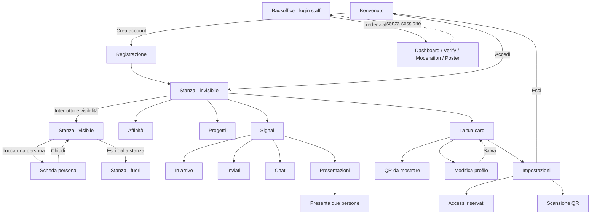
```mermaid
graph TD
    A[Benvenuto] -->|Crea account| B[Registrazione]
    B --> C[Stanza - invisibile]
    A -->|Accedi| C
    C -->|Interruttore visibilità| D[Stanza - visibile]
    D -->|Tocca una persona| E[Scheda persona]
    E -->|Chiudi| D
    D -->|Esci dalla stanza| F[Stanza - fuori]

    C --> G[Affinità]
    C --> H[Progetti]
    C --> I[Signal]
    C --> J[La tua card]

    I --> I1[In arrivo]
    I --> I2[Inviati]
    I --> I3[Chat]
    I --> I4[Presentazioni]
    I4 --> I5[Presenta due persone]

    J --> K[QR da mostrare]
    J --> L[Modifica profilo]
    L -->|Salva| J
    J --> M[Impostazioni]
    M --> N[Accessi riservati]
    M --> O[Scansione QR]
    M -->|Esci| A

    S[Backoffice - login staff] -->|credenziali staff| T[Dashboard / Verify / Moderation / Poster]
    T -.->|senza sessione| S
```

---

## 3. Analisi schermata per schermata

### App soci

#### 01 · Benvenuto
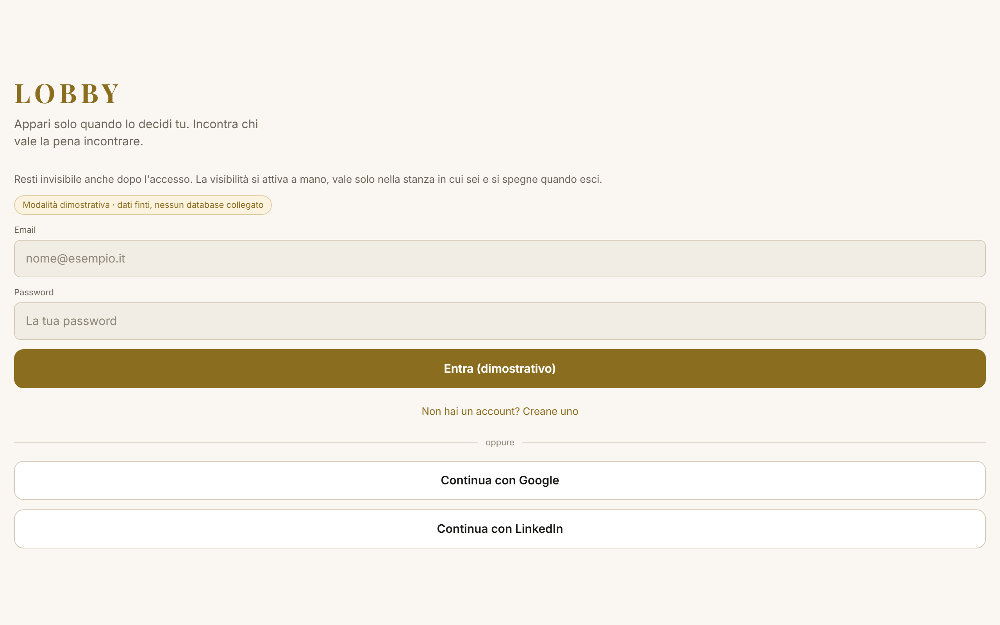

- **Scopo:** porta d'ingresso; spiega il prodotto e offre accesso o registrazione.
- **Componenti:** titolo editoriale, campi email e password, pulsanti "Accedi" / "Crea account", avviso di modalità dimostrativa.
- **Esito:** ✅ Funzionante

#### 02 · Registrazione — modulo compilato
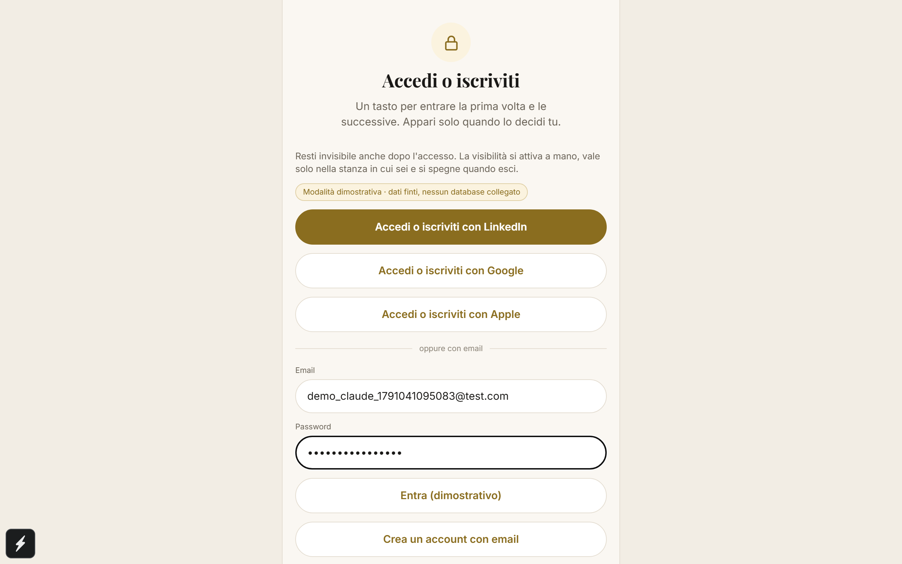

- **Scopo:** creare un nuovo account.
- **Componenti:** campi email e password compilati con l'account di prova univoco, pulsante di conferma.
- **Esito:** ✅ Funzionante — il segnaposto della password ora è "La tua password" (prima erano pallini che sembravano un valore già scritto).

#### 03 · Dopo la registrazione
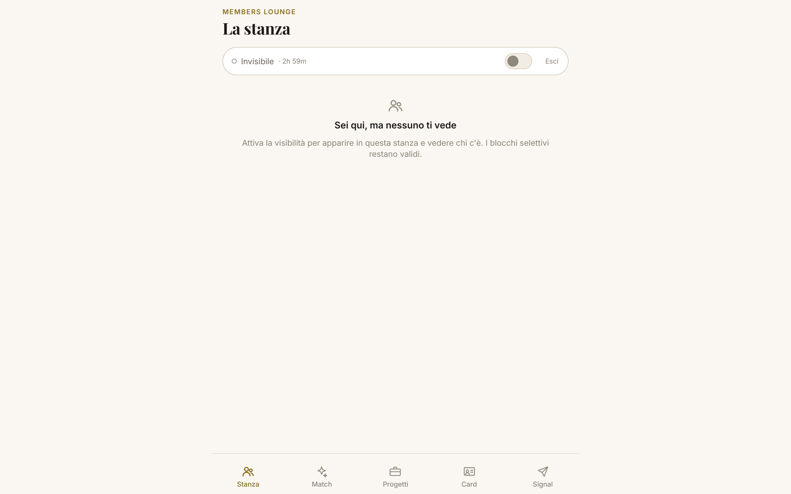

- **Scopo:** primo approdo del nuovo socio.
- **Componenti:** barra di presenza, elenco della stanza, barra delle schede.
- **Esito:** ✅ Funzionante — in demo si entra subito nella stanza dimostrativa, invisibili.

#### 04 · Impostazioni e uscita

- **Scopo:** uscire dall'account per poter provare l'accesso.
- **Componenti:** elenco impostazioni, pulsante "Esci".
- **Esito:** ✅ Funzionante — l'uscita riporta al benvenuto.

#### 05 · Accesso con le credenziali create

- **Scopo:** rientrare con l'account appena creato.
- **Componenti:** modulo di accesso, reindirizzamento alla stanza.
- **Esito:** ✅ Funzionante

#### 06 · Stanza — dentro, invisibile
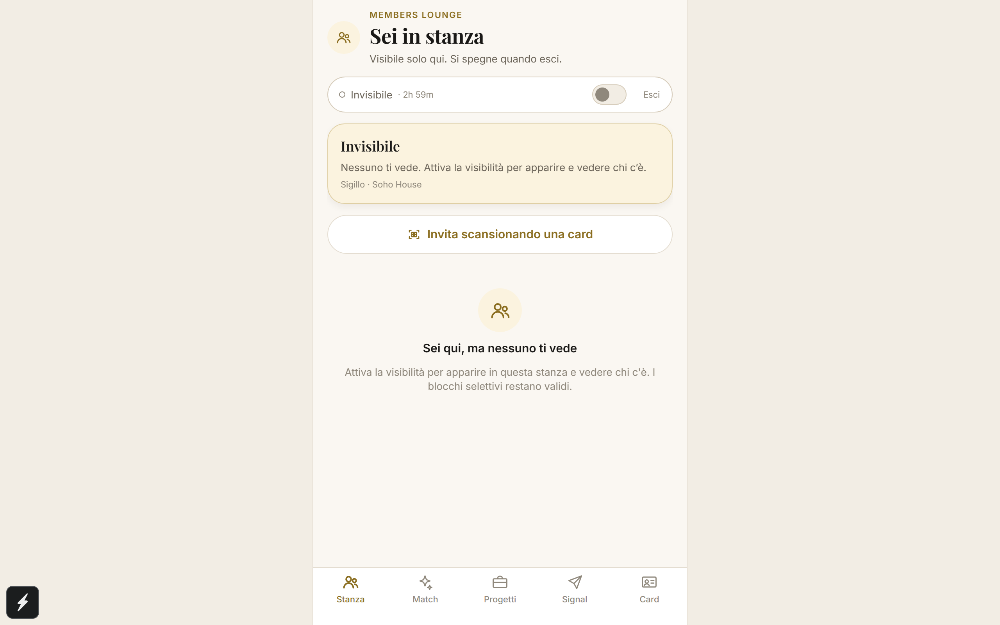

- **Scopo:** sei nel luogo ma nessuno ti vede finché non lo decidi tu.
- **Componenti:** messaggio "Sei qui, ma nessuno ti vede", interruttore di visibilità, nome della stanza.
- **Esito:** ✅ Funzionante — l'invisibilità all'ingresso è rispettata.

#### 07 · Stanza — visibile
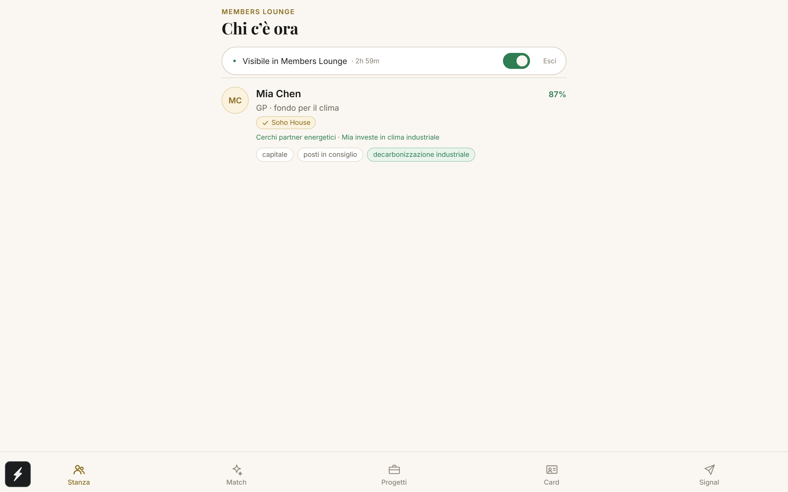

- **Scopo:** vedere chi c'è, una volta resi visibili.
- **Componenti:** interruttore acceso, conto alla rovescia della presenza ("2h 59m"), elenco persone con percentuale di affinità (Mia Chen 87%), "Esci dalla stanza".
- **Esito:** ✅ Funzionante — **corretto**: l'interruttore ora dichiara il proprio stato (`aria-checked=true` da acceso) e sia l'interruttore sia "Esci" hanno un'area toccabile di 44 px.

#### 08 · Scheda della persona
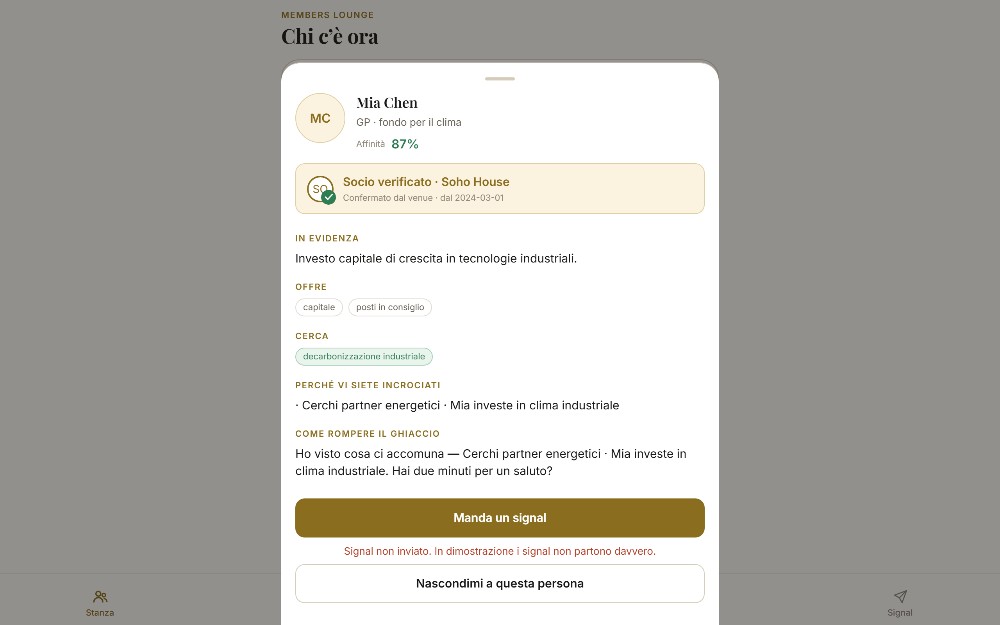

- **Scopo:** approfondire un profilo prima di contattarlo.
- **Componenti:** foglio dal basso con nome, ruolo, interessi, frase d'apertura suggerita, "Manda un signal".
- **Esito:** ✅ Funzionante — **corretto**: l'esito del signal compare nella scheda. Prima usava un avviso di sistema che sul web non mostra nulla, quindi il pulsante sembrava rotto anche fuori dalla dimostrazione.

#### 09 · Affinità
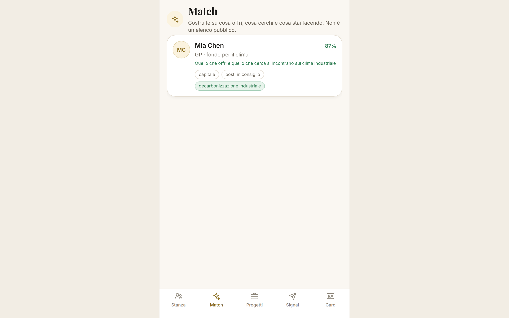

- **Scopo:** le persone più compatibili, in ordine.
- **Componenti:** elenco ordinato per punteggio, motivi dell'affinità.
- **Esito:** ✅ Funzionante — la scheda persona si era chiusa correttamente.

#### 10 · Progetti
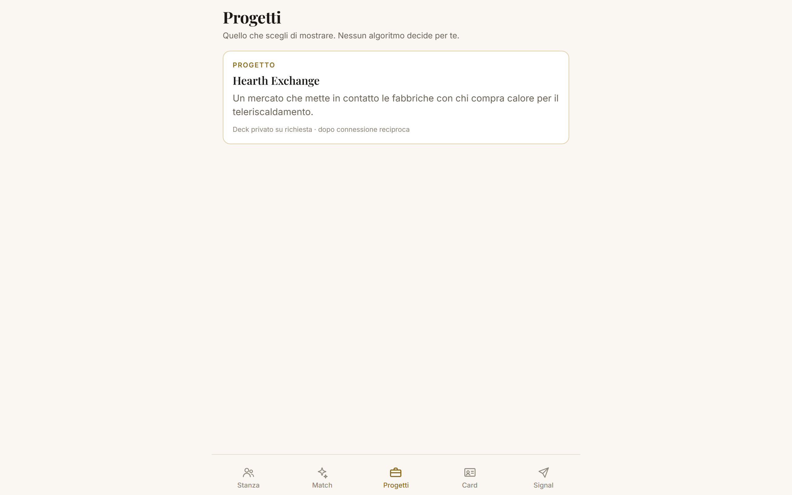

- **Scopo:** vetrina dei progetti dei soci presenti.
- **Componenti:** schede progetto con autore e descrizione.
- **Esito:** ✅ Funzionante

#### 11 · La tua card
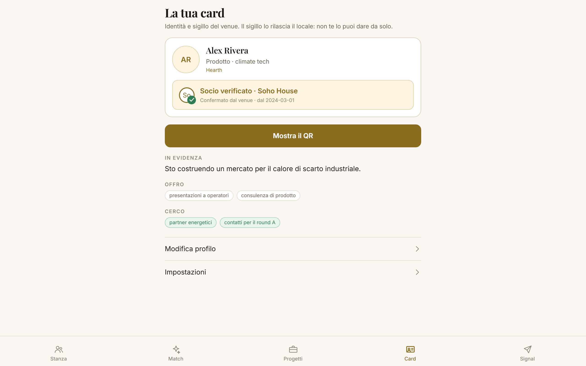

- **Scopo:** il proprio biglietto da visita.
- **Componenti:** card con nome e ruolo, accessi a QR, modifica profilo e impostazioni.
- **Esito:** ✅ Funzionante

#### 12 · QR da mostrare
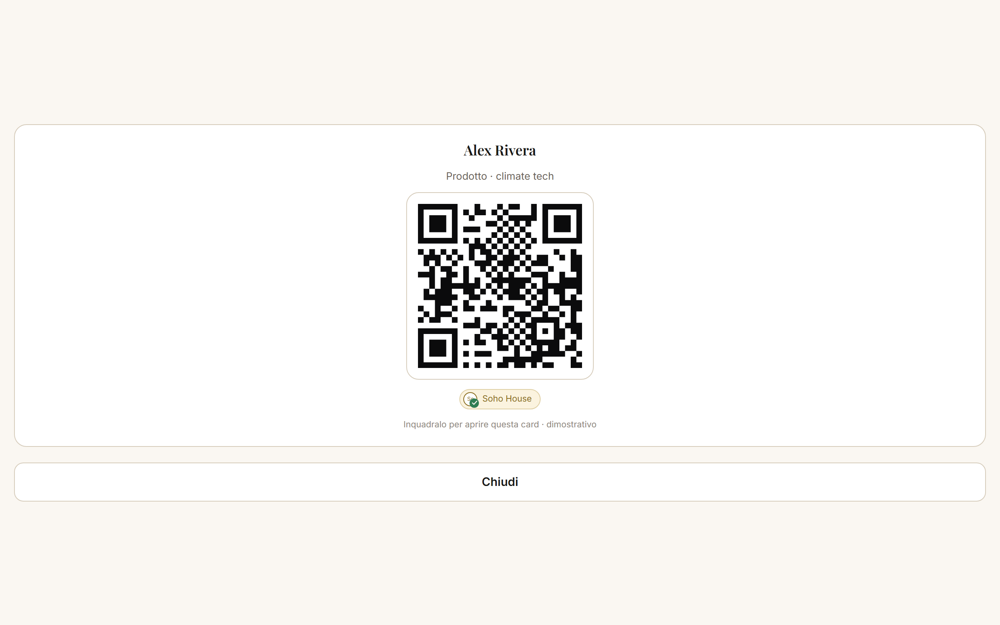

- **Scopo:** farsi riconoscere di persona.
- **Componenti:** codice QR disegnato in SVG, nome del socio.
- **Esito:** ✅ Funzionante

#### 13 · Modifica profilo
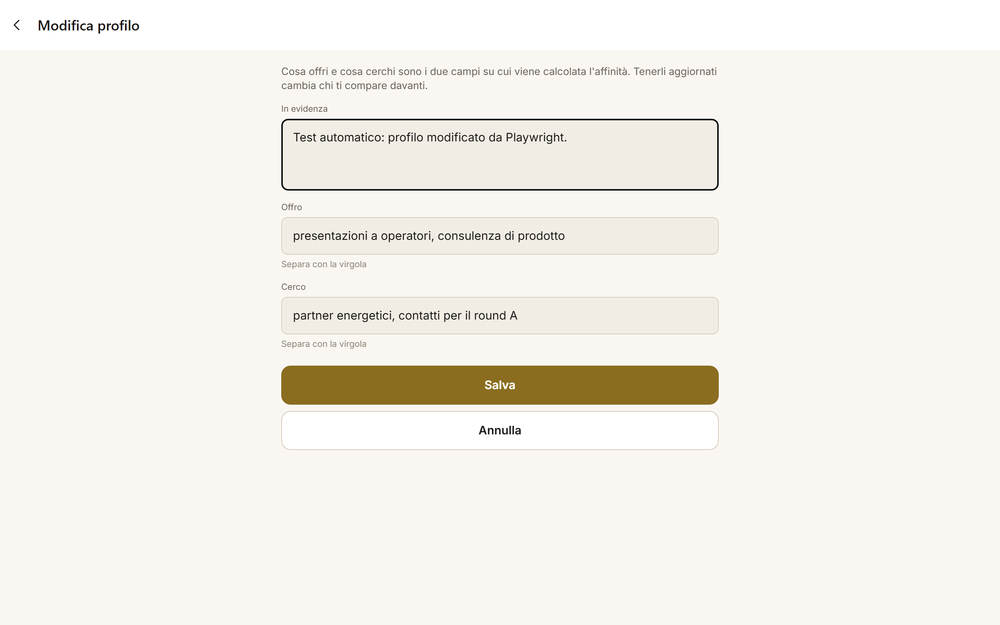

- **Scopo:** aggiornare i propri dati.
- **Componenti:** campi nome, ruolo, azienda, presentazione, interessi; pulsante "Salva".
- **Esito:** ✅ Funzionante

#### 14 · Profilo salvato
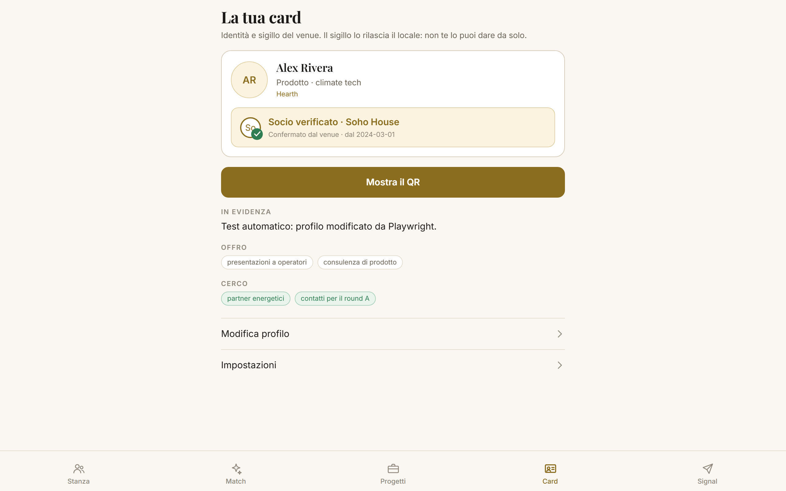

- **Scopo:** verificare che la modifica resti.
- **Componenti:** la card con il valore appena modificato.
- **Esito:** ✅ Funzionante — la modifica compare sulla card.

#### 15 · Impostazioni
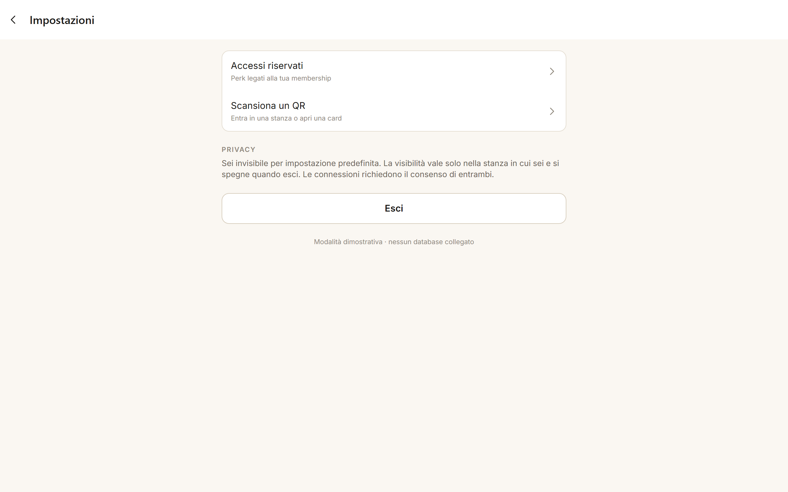

- **Scopo:** preferenze, accessi, uscita.
- **Componenti:** intestazione con freccia indietro, voci per tema, accessi riservati, scansione, uscita.
- **Esito:** ✅ Funzionante — **corretto**: la freccia indietro si annuncia come "Indietro" (prima "(tabs), back").

#### 16 · Accessi riservati
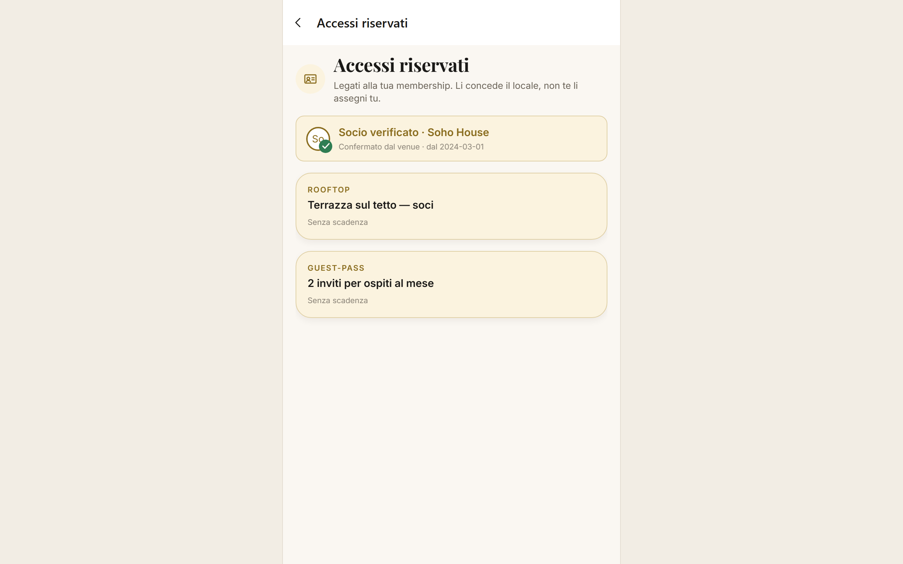

- **Scopo:** i pass e i vantaggi del socio.
- **Componenti:** elenco dei pass e dei benefici collegati.
- **Esito:** ✅ Funzionante

#### 17 · Scansione QR
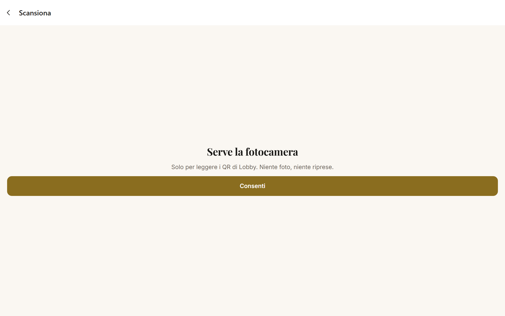

- **Scopo:** entrare in una stanza inquadrando il codice del luogo.
- **Componenti:** richiesta del permesso per la fotocamera.
- **Esito:** ✅ Funzionante — verificato solo lo stato "permesso richiesto"; la lettura vera va provata su un telefono.

#### 18 · Signal — in arrivo

- **Scopo:** le richieste di contatto ricevute.
- **Componenti:** selettore a quattro sezioni con contatori, schede con "Connetti" / "Rifiuta".
- **Esito:** ✅ Funzionante

#### 19 · Signal — inviati
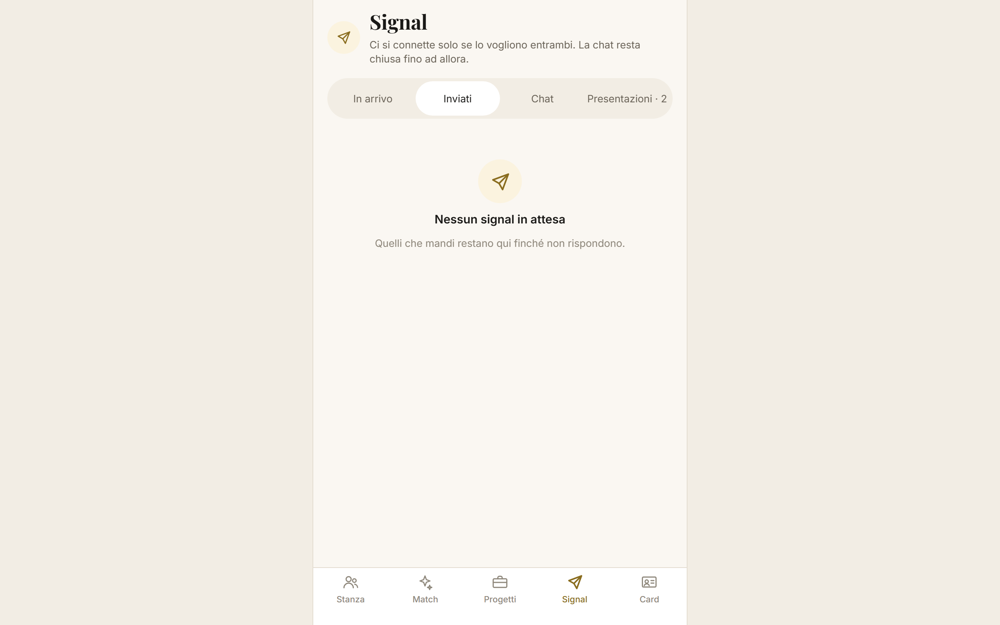

- **Scopo:** le richieste mandate e ancora in attesa.
- **Componenti:** elenco con stato "In attesa di consenso".
- **Esito:** ✅ Funzionante

#### 20 · Signal — chat
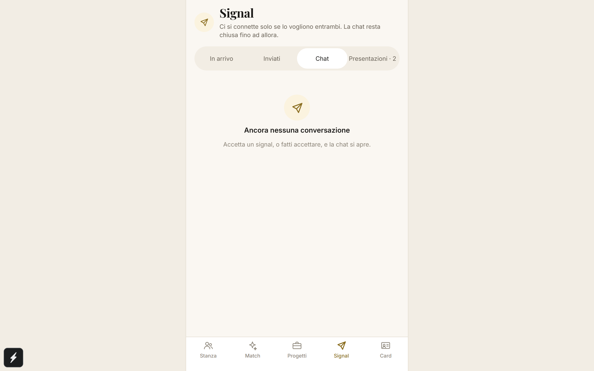

- **Scopo:** le conversazioni aperte dopo il consenso reciproco.
- **Componenti:** righe chat con ultimo messaggio ed etichetta "Connessi".
- **Esito:** ✅ Funzionante

#### 21 · Signal — presentazioni
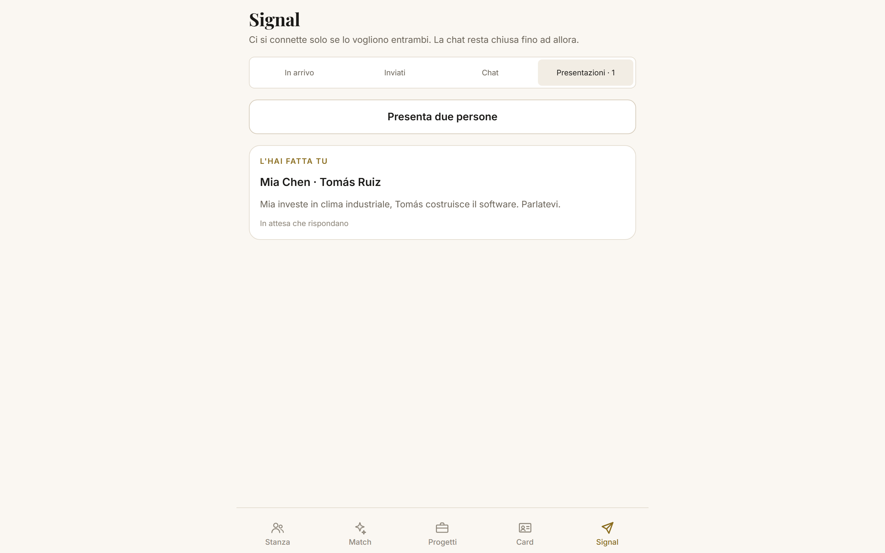

- **Scopo:** le presentazioni fatte e ricevute.
- **Componenti:** "Presenta due persone", schede con "Accetta" / "Lascia stare".
- **Esito:** ✅ Funzionante — **corretto**: la presentazione accettata esce da quelle in attesa anche in dimostrazione.

#### 22 · Presenta due persone
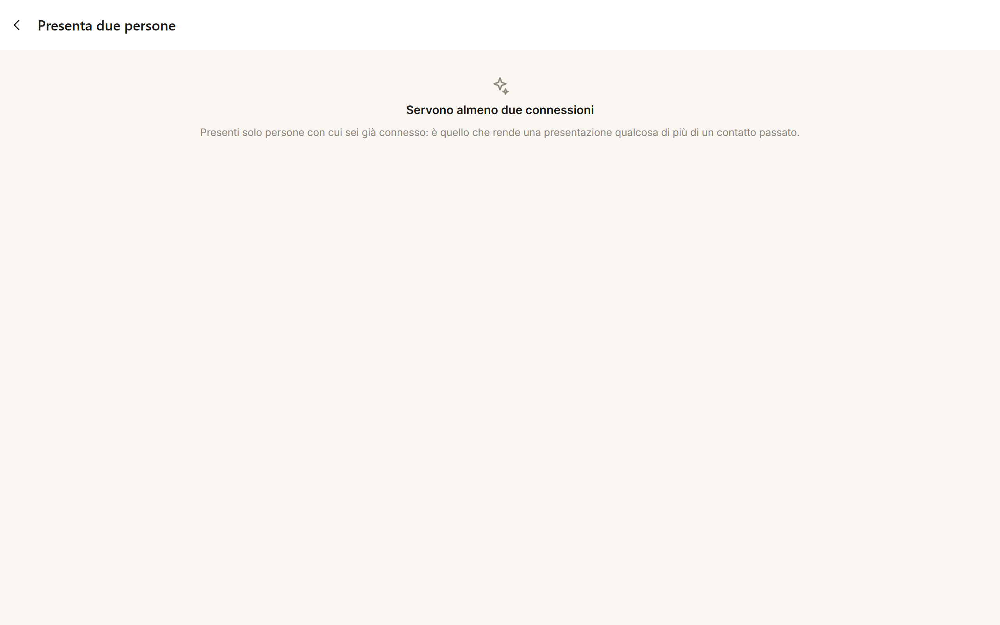

- **Scopo:** mettere in contatto due proprie connessioni.
- **Componenti:** stato vuoto "Servono almeno due connessioni".
- **Esito:** ✅ Funzionante — con i dati demo si vede solo lo stato vuoto; il modulo di selezione non è stato esercitato.

#### 23 · Stanza — fuori
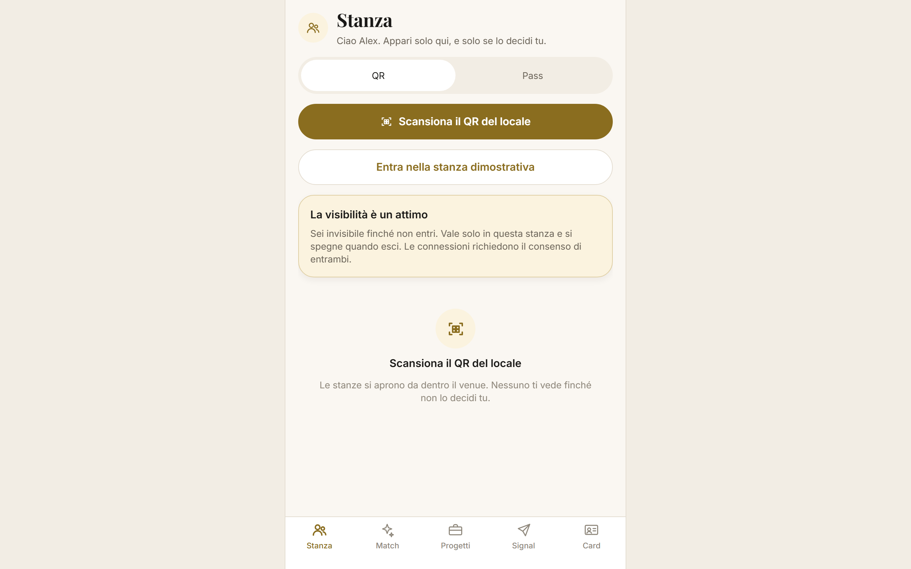

- **Scopo:** lasciare la stanza.
- **Componenti:** invito a entrare in una stanza, accesso alla scansione.
- **Esito:** ✅ Funzionante — "Entra nella stanza dimostrativa" ora è un pulsante vero; fuori dalla dimostrazione lo stesso pulsante porta alla scansione del codice.

#### 24 · Tasto indietro del browser
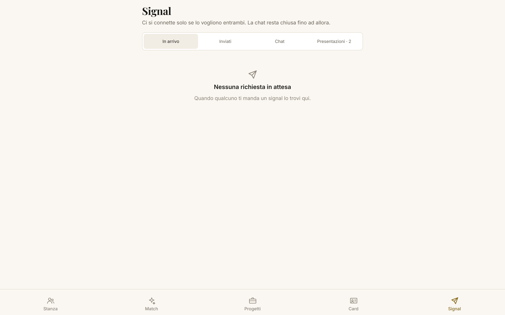

- **Scopo:** verificare che la cronologia del browser sia coerente.
- **Componenti:** nessuno specifico — è una prova di navigazione.
- **Esito:** ✅ Funzionante — **corretto**: dopo la sequenza apri → indietro → cambia scheda → apri → indietro si atterra su `/signals` con la sessione intatta. Alla prima esecuzione si finiva su `/welcome`, fuori dall'account.

#### 25 · Pagina inesistente
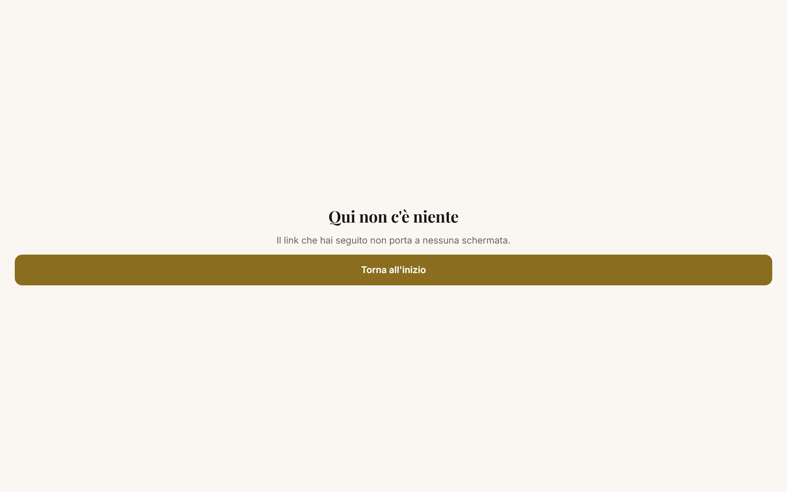

- **Scopo:** gestire un indirizzo sbagliato.
- **Componenti:** schermata "non trovata" con ritorno all'app.
- **Esito:** ✅ Funzionante — il server risponde 404 (corretto per un indirizzo che non esiste) e l'app mostra la propria schermata.

#### 26 · Tema scuro — benvenuto
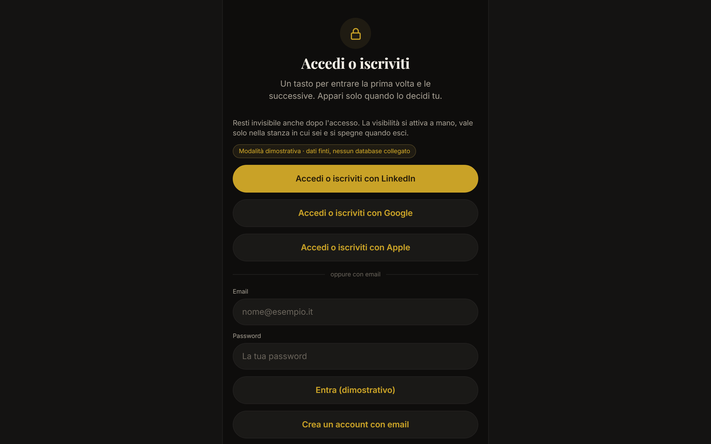

- **Scopo:** verificare il tema scuro seguendo la preferenza di sistema.
- **Componenti:** stessa schermata di benvenuto, sfondo misurato `rgb(14, 13, 12)`.
- **Esito:** ✅ Funzionante

#### 27 · Tema scuro — stanza
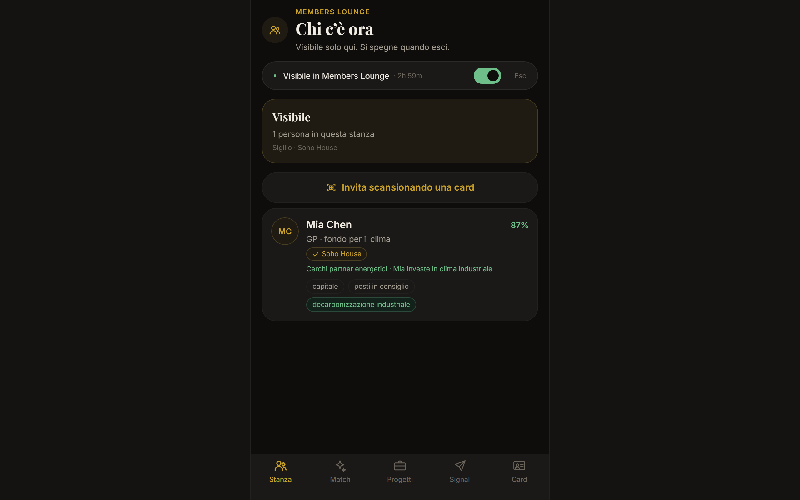

- **Scopo:** leggibilità della stanza in scuro.
- **Componenti:** barra di presenza, elenco persone, barra delle schede.
- **Esito:** ✅ Funzionante

### Backoffice staff

#### 28 · Backoffice — accesso staff
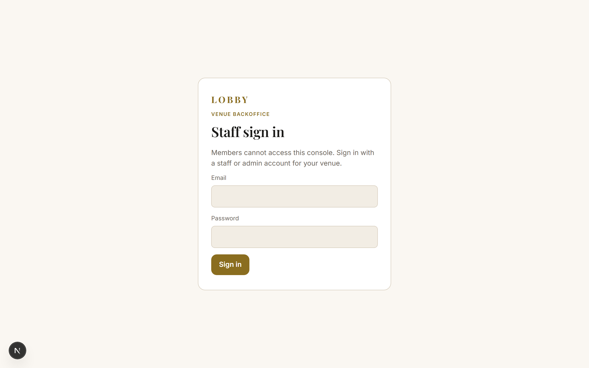

- **Scopo:** accesso riservato allo staff del luogo.
- **Componenti:** titolo in Playfair Display, campi email e password, "Sign in"; 72 variabili `--lobby-*` del tema iniettate.
- **Esito:** ✅ Funzionante — interfaccia interamente in inglese, mentre l'app soci è in italiano.

#### 29 · Backoffice — validazione del modulo
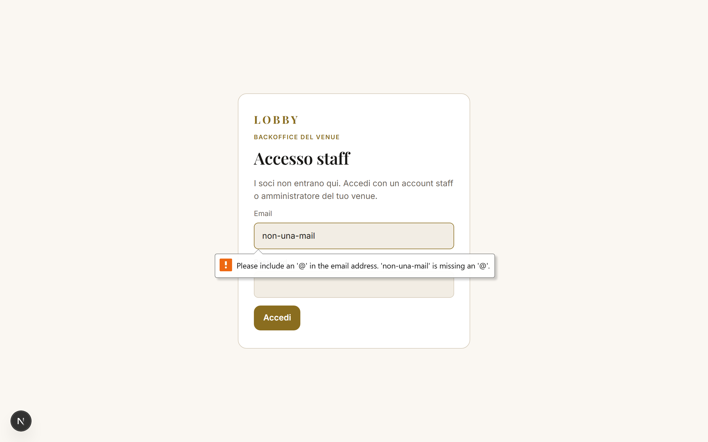

- **Scopo:** impedire invii incompleti.
- **Componenti:** validazione nativa del browser sui campi obbligatori e sul formato email.
- **Esito:** ✅ Funzionante — invio a vuoto ed email malformata bloccati. Nessuna credenziale è stata inviata.

#### 30 · Backoffice — rotte protette

- **Scopo:** nessuna pagina staff deve aprirsi senza sessione.
- **Componenti:** reindirizzamento a `/login?next=…`.
- **Esito:** ✅ Funzionante — `/dashboard`, `/verify`, `/moderation`, `/poster` rimandano tutte al login.

---

## 4. Note tecniche e raccomandazioni

### Log della console (seconda esecuzione)

| Tipo | Volte | Messaggio | Valutazione |
|---|---|---|---|
| error | 1 | `Failed to load resource: the server responded with a status of 404` | Atteso: è la risposta alla pagina inesistente del passo 25. |

Nessun avviso, nessuna eccezione JavaScript non gestita, nessuna richiesta di rete fallita. I due avvisi della prima esecuzione (`expo-notifications` e `useNativeDriver`) sono stati eliminati.

### Cosa è stato corretto

| # | Difetto trovato | Causa | Correzione |
|---|---|---|---|
| 1 | Indietro del browser → benvenuto, sessione persa | Quando la cronologia del browser e quella di navigazione divergono, expo-router rimonta l'intera app. La sessione dimostrativa viveva solo nello stato dei componenti e spariva. | Sessione, profilo e presenza dimostrativi sono ricordati fuori dai componenti (`demoMemory` in `lib/demo.ts`) e ripresi al rimontaggio. |
| 2 | Interruttore di visibilità muto per i lettori di schermo | `react-native-web` ignora `accessibilityState`. | Sostituito con gli attributi `aria-*` in tutta l'app: interruttore, segmenti, chip, pulsanti, caselle di "Presenta". |
| 3 | Freccia indietro annunciata come "(tabs), back" | L'intestazione di serie usa il nome della cartella di rotte. | Freccia propria sul web con etichetta "Indietro"; su iOS e Android resta quella nativa. |
| 4 | Aree toccabili sotto i 44 px | `hitSlop` sul web non allarga l'area. | Altezza e larghezza minime reali su interruttore e "Esci". |
| 5 | "Manda un signal" senza riscontro | `Alert.alert` sul web non mostra nulla. | Esito scritto dentro la scheda, in dimostrazione e non. |
| 6 | "Accetta" su una presentazione non cambiava nulla in dimostrazione | La risposta veniva scartata. | Lo stato si aggiorna in locale. |
| 7 | Avvisi in console a ogni caricamento | Notifiche push e driver di animazione nativo non esistono sul web. | Variante web senza notifiche; driver nativo solo su iOS e Android. |
| 8 | Layout allargato a tutta pagina su desktop | Nessuna larghezza massima. | Colonna centrata di 560 px per schermate e scheda persona. |
| 9 | Lingue mescolate nell'app soci | Dati dimostrativi, frasi d'apertura e alcuni errori in inglese. | Tradotti in italiano. |
| 10 | Segnaposto della password ambiguo | Pallini al posto di un testo. | "La tua password". |
| 11 | Rientro in stanza poco visibile | Riga grigia da 11 px. | Pulsante; fuori dalla dimostrazione porta alla scansione. |

### Cosa resta aperto

- **Il rimontaggio dell'app esiste ancora.** La correzione 1 rende la dimostrazione resistente, non elimina la causa, che sta nella gestione della cronologia di expo-router / React Navigation sul web. Con l'autenticazione reale la sessione si rilegge dallo storage, quindi l'effetto atteso è un ricaricamento della schermata senza uscita dall'account — **non verificato**, perché il test gira in dimostrazione. Lo stato locale delle schermate (per esempio la sezione scelta in Signal) si perde comunque.
- **Motivi dell'affinità in inglese dal server.** In dimostrazione sono tradotti; con il database vero li scrive una funzione SQL già applicata al progetto condiviso. Serve una nuova migrazione, da fare a parte.
- **Backoffice in inglese.** Non toccato: va deciso se lo staff lo vuole in italiano.
- **Intestazioni native a tutta larghezza su desktop.** Il contenuto è centrato, la barra del titolo e quella delle schede no.

### Prestazioni

Nessun rallentamento osservato: ogni schermata si è resa entro i tempi di attesa dello script. Sono misure su server di sviluppo, non indicative della versione di produzione; per quella servono una build e un'analisi dedicata.

### Limiti di questo test

- Modalità dimostrativa: autenticazione, regole di accesso e codici a rotazione **non** sono stati esercitati contro il database.
- Backoffice verificato solo fino al login.
- Solo Chromium su desktop: nessun dispositivo fisico, nessun Safari, nessuna fotocamera. Le correzioni non sono state provate su iOS o Android.

### File prodotti

- `scripts/claude_auto_test.js` — lo script
- `report/screenshots/` — 30 immagini (seconda esecuzione)
- `report/results.json` — esiti e log in forma leggibile da macchina
- `report/CLAUDE_TEST_REPORT.md` — questo documento
